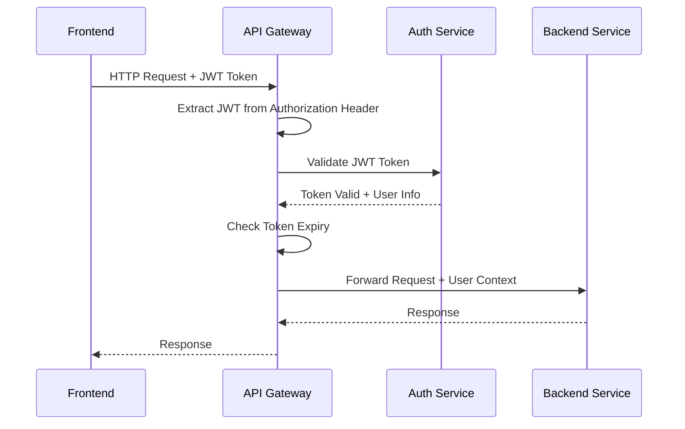
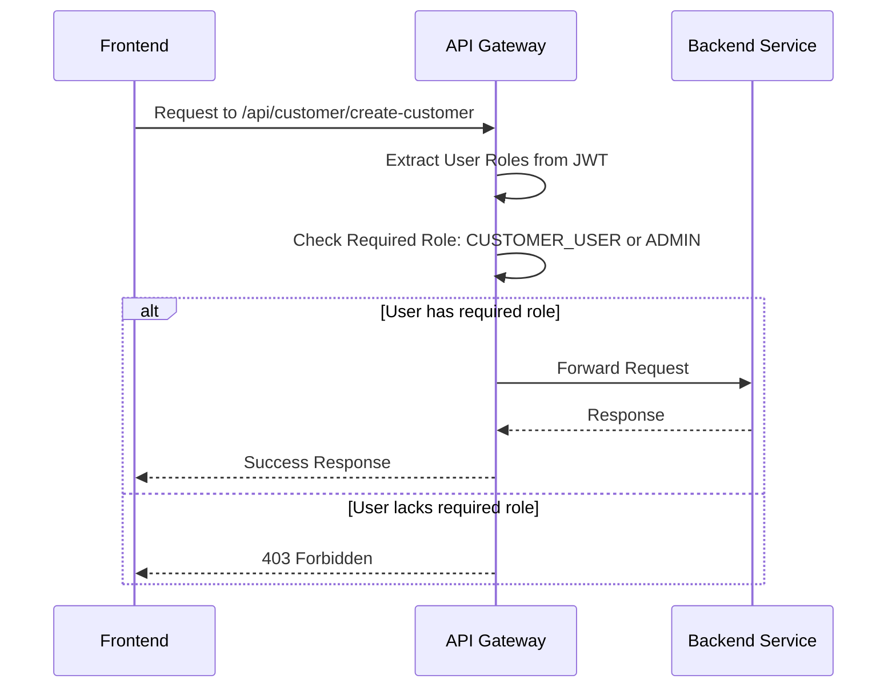
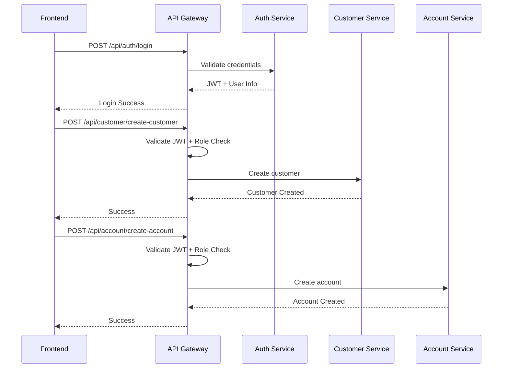
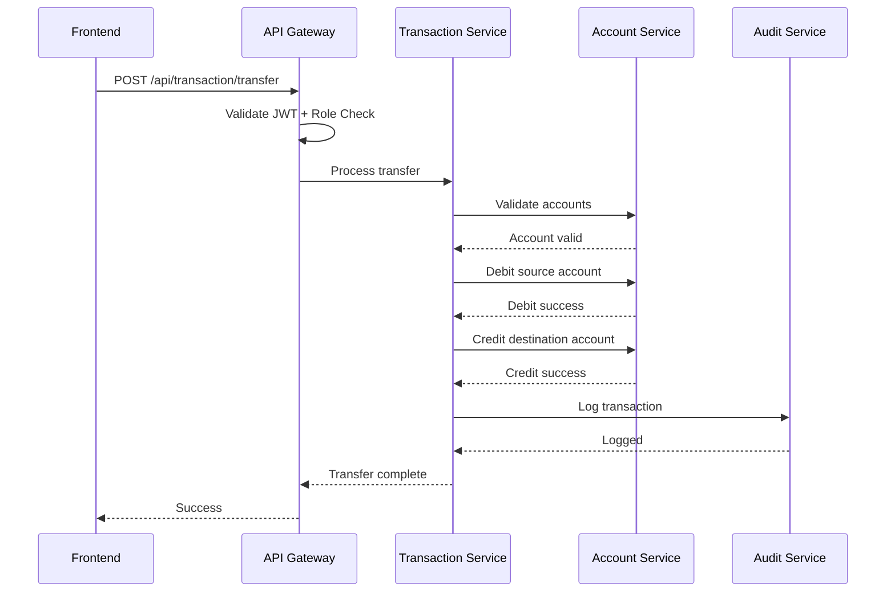

# 🔄 API Gateway Authentication & Authorization Flows

## 🏗️ Architecture Overview

```
Frontend (React)
    ↓ HTTP Request
API Gateway (Port 8080)
    ↓ Authentication Check
JWT Validation
    ↓ Authorization Check
Role-Based Access
    ↓ Route to Service
Backend Microservice
    ↓ Business Logic
Database
```

---

## 🔐 Authentication Flow

### 1. **Initial Request Flow**


### 2. **Authentication Process**
```typescript
// API Gateway Authentication Filter
public class AuthenticationFilter {
    
    public Mono<Void> filter(ServerWebExchange exchange, GatewayFilterChain chain) {
        String authHeader = exchange.getRequest().getHeaders().getFirst("Authorization");
        
        if (authHeader == null || !authHeader.startsWith("Bearer ")) {
            return handleUnauthorized(exchange); // 401
        }
        
        String token = authHeader.substring(7);
        
        // Validate JWT with Auth Service
        return authClient.validateToken(token)
            .flatMap(isValid -> {
                if (isValid) {
                    // Add user info to request headers
                    ServerHttpRequest modifiedRequest = exchange.getRequest()
                        .mutate()
                        .header("X-User-Id", user.getUserId().toString())
                        .header("X-Username", user.getUsername())
                        .header("X-Roles", String.join(",", user.getRoles()))
                        .build();
                    
                    return chain.filter(exchange.mutate().request(modifiedRequest));
                } else {
                    return handleUnauthorized(exchange); // 401
                }
            });
    }
}
```

---

## 🛡️ Authorization Flow

### 1. **Role-Based Authorization**


### 2. **Authorization Configuration**
```yaml
# API Gateway Routes Configuration
spring:
  cloud:
    gateway:
      routes:
        # Authentication Routes (No auth required)
        - id: auth-service
          uri: http://localhost:9093
          predicates:
            - Path=/api/auth/**
          filters:
            - StripPrefix=0
        
        # Customer Service Routes (Authentication + Authorization)
        - id: customer-service
          uri: http://localhost:9094
          predicates:
            - Path=/api/customer/**
          filters:
            - StripPrefix=0
            - TokenRelay=
            - AuthorizationFilter=AUTHENTICATED
            - RoleAuthorizationFilter=CUSTOMER_USER,ADMIN,BANK_STAFF
        
        # Account Service Routes
        - id: account-service
          uri: http://localhost:9095
          predicates:
            - Path=/api/account/**
          filters:
            - StripPrefix=0
            - TokenRelay=
            - AuthorizationFilter=AUTHENTICATED
            - RoleAuthorizationFilter=CUSTOMER_USER,ADMIN,BANK_STAFF
        
        # Transaction Service Routes
        - id: transaction-service
          uri: http://localhost:9096
          predicates:
            - Path=/api/transaction/**
          filters:
            - StripPrefix=0
            - TokenRelay=
            - AuthorizationFilter=AUTHENTICATED
            - RoleAuthorizationFilter=CUSTOMER_USER,ADMIN,BANK_STAFF
        
        # Audit Service Routes (Admin/Auditor only)
        - id: audit-service
          uri: http://localhost:9099
          predicates:
            - Path=/api/audit/**
          filters:
            - StripPrefix=0
            - TokenRelay=
            - AuthorizationFilter=AUTHENTICATED
            - RoleAuthorizationFilter=ADMIN,AUDITOR
        
        # User Management Routes (Admin only)
        - id: user-service
          uri: http://localhost:9093
          predicates:
            - Path=/api/users/**
          filters:
            - StripPrefix=0
            - TokenRelay=
            - AuthorizationFilter=AUTHENTICATED
            - RoleAuthorizationFilter=ADMIN
```

---

## 📋 Detailed API Flows by Service

### 1. **Authentication Service APIs**

#### **Login Flow** (No Authentication Required)
```
Frontend → API Gateway → Auth Service
POST /api/auth/login
Headers: No Authorization Required
Response: JWT Token + User Info
```

#### **Protected Auth APIs**
```
Frontend → API Gateway → Auth Service
POST /api/auth/forgot-password
Headers: Authorization: Bearer <JWT>
Gateway Check: Token Valid Only
```

### 2. **Customer Service APIs**

#### **Create Customer** (Requires CUSTOMER_USER/ADMIN)
```
Frontend → API Gateway → Customer Service
POST /api/customer/create-customer
Headers: 
  Authorization: Bearer <JWT>
  X-User-Id: 12345
  X-Username: john.doe
  X-Roles: CUSTOMER_USER

Gateway Authorization:
  ✅ Token Valid
  ✅ User has required role
  ✅ Forward to Customer Service

Customer Service:
  Receives user context in headers
  Creates customer record
  Logs audit trail
```

#### **Get Customer by ID** (Requires Authentication)
```
Frontend → API Gateway → Customer Service
GET /api/customer/single/{customerId}
Headers: 
  Authorization: Bearer <JWT>
  X-User-Id: 12345
  X-Username: john.doe
  X-Roles: CUSTOMER_USER

Gateway Authorization:
  ✅ Token Valid
  ✅ Any authenticated user can access
  ✅ Forward to Customer Service

Customer Service:
  Validates user-customer relationship
  Returns customer data
```

### 3. **Account Service APIs**

#### **Create Account** (Requires CUSTOMER_USER/ADMIN)
```
Frontend → API Gateway → Account Service
POST /api/account/create-account
Headers: 
  Authorization: Bearer <JWT>
  X-User-Id: 12345
  X-Username: john.doe
  X-Roles: CUSTOMER_USER

Gateway Authorization:
  ✅ Token Valid
  ✅ User has required role
  ✅ Forward to Account Service

Account Service:
  Validates customer ownership
  Creates account
  Updates audit log
```

#### **Get User Accounts** (Requires Authentication)
```
Frontend → API Gateway → Account Service
GET /api/account/getall?userId=12345
Headers: 
  Authorization: Bearer <JWT>
  X-User-Id: 12345
  X-Username: john.doe
  X-Roles: CUSTOMER_USER

Gateway Authorization:
  ✅ Token Valid
  ✅ User can only access own accounts
  ✅ Forward to Account Service

Account Service:
  Validates userId matches X-User-Id
  Returns user's accounts
```

### 4. **Transaction Service APIs**

#### **Fund Transfer** (Requires CUSTOMER_USER/ADMIN)
```
Frontend → API Gateway → Transaction Service
POST /api/transaction/transfer
Headers: 
  Authorization: Bearer <JWT>
  X-User-Id: 12345
  X-Username: john.doe
  X-Roles: CUSTOMER_USER
  Idempotency-Key: unique-key-123

Gateway Authorization:
  ✅ Token Valid
  ✅ User has required role
  ✅ Idempotency check
  ✅ Forward to Transaction Service

Transaction Service:
  Validates account ownership
  Performs transfer
  Updates balances
  Creates transaction record
  Publishes audit event
```

### 5. **Audit Service APIs**

#### **Get All Logs** (Requires ADMIN/AUDITOR)
```
Frontend → API Gateway → Audit Service
GET /api/audit/all
Headers: 
  Authorization: Bearer <JWT>
  X-User-Id: 12345
  X-Username: admin.user
  X-Roles: ADMIN

Gateway Authorization:
  ✅ Token Valid
  ✅ User has ADMIN or AUDITOR role
  ✅ Forward to Audit Service

Audit Service:
  Returns audit logs
  Applies role-based filtering
```

### 6. **User Management APIs**

#### **Get All Users** (Requires ADMIN)
```
Frontend → API Gateway → Auth Service
GET /api/users/get
Headers: 
  Authorization: Bearer <JWT>
  X-User-Id: 12345
  X-Username: admin.user
  X-Roles: ADMIN

Gateway Authorization:
  ✅ Token Valid
  ✅ User has ADMIN role
  ✅ Forward to Auth Service

Auth Service:
  Returns all users
  Applies admin-level filtering
```

---

## 🔒 Security Implementation Details

### 1. **JWT Token Structure**
```json
{
  "header": {
    "alg": "HS256",
    "typ": "JWT"
  },
  "payload": {
    "sub": "john.doe",
    "userId": 12345,
    "username": "john.doe",
    "roles": ["CUSTOMER_USER"],
    "permissions": ["PERMISSION_READ", "PERMISSION_WRITE"],
    "iat": 1643723400,
    "exp": 1643727000
  }
}
```

### 2. **Gateway Filter Chain**
```java
@Component
public class SecurityGatewayFilter implements GlobalFilter, Ordered {
    
    @Override
    public Mono<Void> filter(ServerWebExchange exchange, GatewayFilterChain chain) {
        ServerHttpRequest request = exchange.getRequest();
        
        // 1. Skip authentication for public endpoints
        if (isPublicEndpoint(request.getPath())) {
            return chain.filter(exchange);
        }
        
        // 2. Extract and validate JWT
        return validateToken(exchange)
            .flatMap(userContext -> {
                // 3. Add user context to request
                ServerHttpRequest modifiedRequest = addUserContext(request, userContext);
                
                // 4. Check authorization
                return checkAuthorization(modifiedRequest, userContext)
                    .flatMap(authorized -> {
                        if (authorized) {
                            return chain.filter(exchange.mutate().request(modifiedRequest));
                        } else {
                            return handleForbidden(exchange);
                        }
                    });
            })
            .onErrorResume(e -> handleUnauthorized(exchange));
    }
}
```

### 3. **Role-Based Access Control**
```java
@Component
public class RoleBasedAuthorizationFilter {
    
    private final Map<String, List<String>> rolePermissions = Map.of(
        "/api/customer/**", Arrays.asList("CUSTOMER_USER", "ADMIN", "BANK_STAFF"),
        "/api/account/**", Arrays.asList("CUSTOMER_USER", "ADMIN", "BANK_STAFF"),
        "/api/transaction/**", Arrays.asList("CUSTOMER_USER", "ADMIN", "BANK_STAFF"),
        "/api/audit/**", Arrays.asList("ADMIN", "AUDITOR"),
        "/api/users/**", Arrays.asList("ADMIN")
    );
    
    public boolean isAuthorized(String path, List<String> userRoles) {
        return rolePermissions.entrySet().stream()
            .filter(entry -> path.startsWith(entry.getKey()))
            .anyMatch(entry -> entry.getValue().stream()
                .anyMatch(userRoles::contains));
    }
}
```

---

## 📊 Flow Examples

### **Customer Registration Flow**


### **Fund Transfer Flow**


---

## 🛡️ Security Headers Applied by Gateway

```http
# All responses include security headers
X-Content-Type-Options: nosniff
X-Frame-Options: DENY
X-XSS-Protection: 1; mode=block
Strict-Transport-Security: max-age=31536000
Content-Security-Policy: default-src 'self'
Referrer-Policy: strict-origin-when-cross-origin
```

---

## 📝 Request/Response Flow Summary

### **Request Flow**
1. **Frontend** → HTTP Request + JWT Token
2. **API Gateway** → Extract JWT from Authorization header
3. **API Gateway** → Validate JWT with Auth Service
4. **API Gateway** → Extract user info (userId, roles, permissions)
5. **API Gateway** → Check authorization for requested endpoint
6. **API Gateway** → Add user context to request headers
7. **API Gateway** → Route to appropriate microservice
8. **Microservice** → Process request with user context
9. **Microservice** → Return response
10. **API Gateway** → Return response to frontend

### **Authorization Check Points**
- **Token Validity**: Is JWT expired or invalid?
- **Role Requirements**: Does user have required role?
- **Resource Ownership**: Can user access requested resource?
- **Permission Check**: Does user have required permission?
- **Rate Limiting**: Is user within rate limits?

---

## 🎯 Key Security Features

✅ **JWT Authentication**: All requests validated  
✅ **Role-Based Authorization**: Banking-grade RBAC  
✅ **Request Context**: User info passed to all services  
✅ **Idempotency**: Financial operations protected  
✅ **Audit Trail**: All actions logged  
✅ **Security Headers**: OWASP compliance  
✅ **Rate Limiting**: DDoS protection  
✅ **CORS Configuration**: Cross-origin security  

---

## 🚀 Implementation Status

**✅ API Gateway**: **CONFIGURED**  
**✅ Authentication**: **IMPLEMENTED**  
**✅ Authorization**: **ROLE-BASED**  
**✅ Security Headers**: **APPLIED**  
**✅ Audit Logging**: **ENABLED**  
**✅ Error Handling**: **COMPREHENSIVE**  

**🎉 RESULT**: **COMPLETE BANKING-GRADE SECURITY IMPLEMENTATION**
