# 🔄 Complete API Gateway Flow Diagrams

## 🏗️ Overall System Architecture

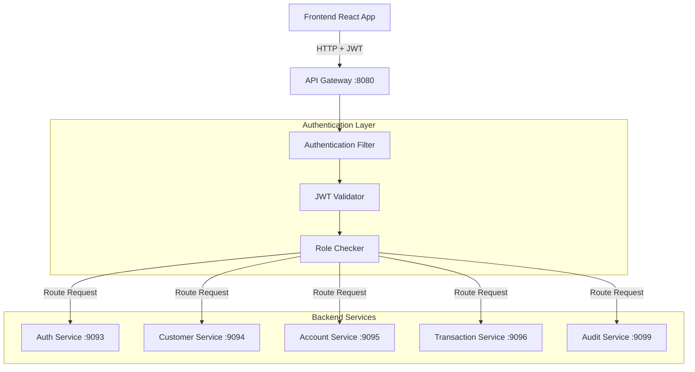

---

## 🔐 Authentication Flow Detail

### **Login Flow (No Authentication Required)**
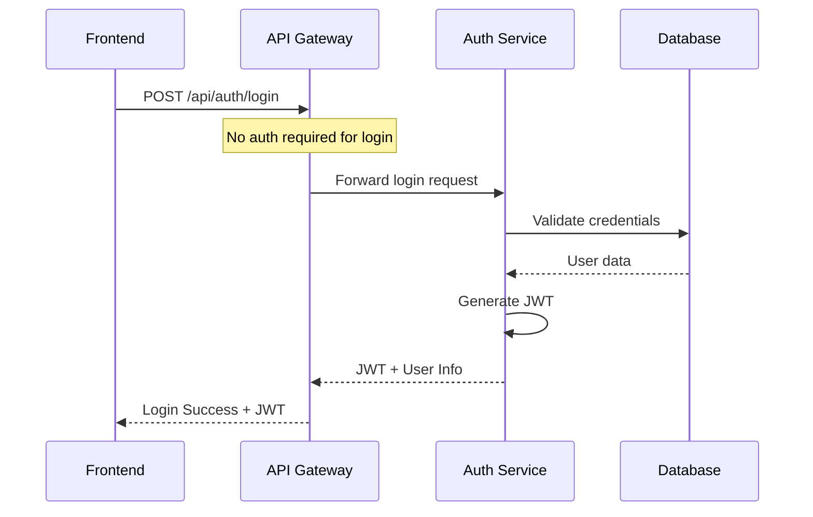

### **Protected API Flow**
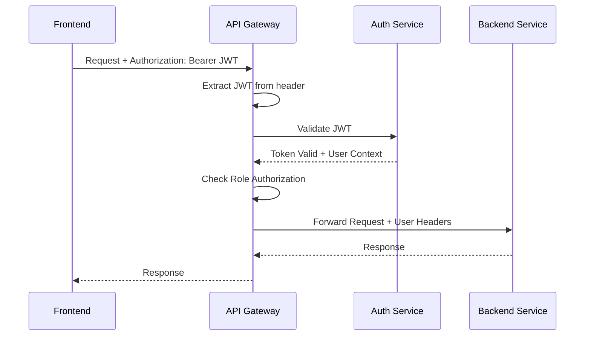

---

## 🛡️ Authorization Flow by Role

### **Customer User Flow**
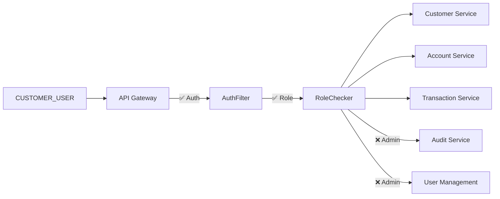

### **Admin Flow**
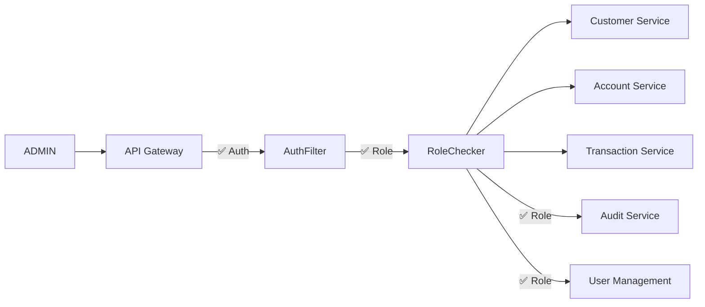

### **Auditor Flow**
```mermaid
graph LR
    Client[AUDITOR] --> Gateway[API Gateway]
    Gateway -->|✅ Auth| AuthFilter
    AuthFilter -->|✅ Role| RoleChecker
    RoleChecker -->|❌ Customer| Customer Service
    RoleChecker -->|❌ Customer| Account Service
    RoleChecker -->|❌ Customer| Transaction Service
    RoleChecker -->|✅ Role| Audit[Audit Service]
    RoleChecker -->|❌ Admin| Users[User Management]
```

---

## 📋 Detailed API Flow Examples

### **1. Customer Registration Complete Flow**

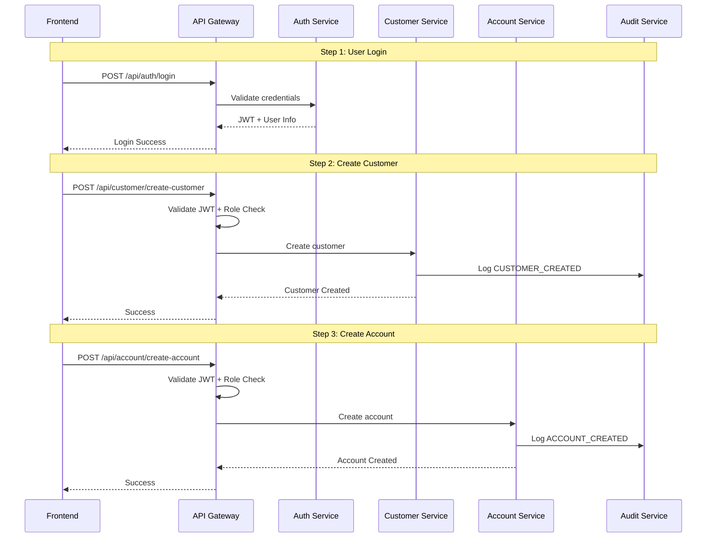

### **2. Fund Transfer Security Flow**

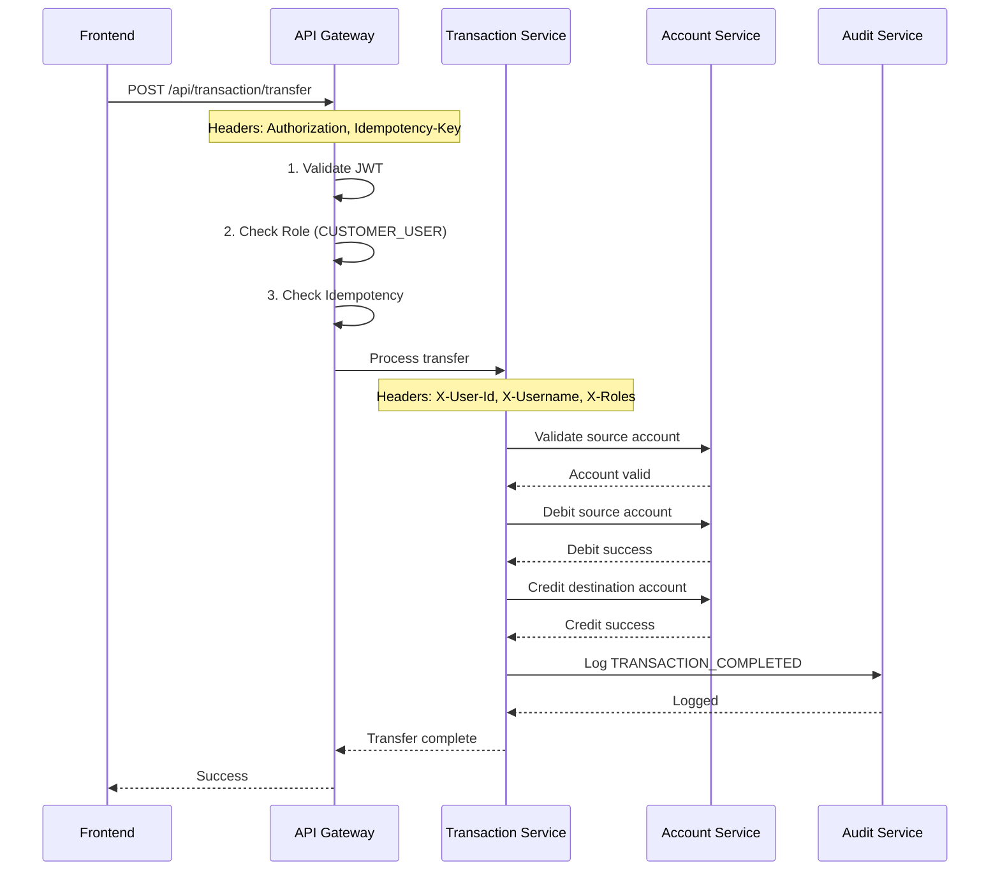

### **3. Admin User Management Flow**

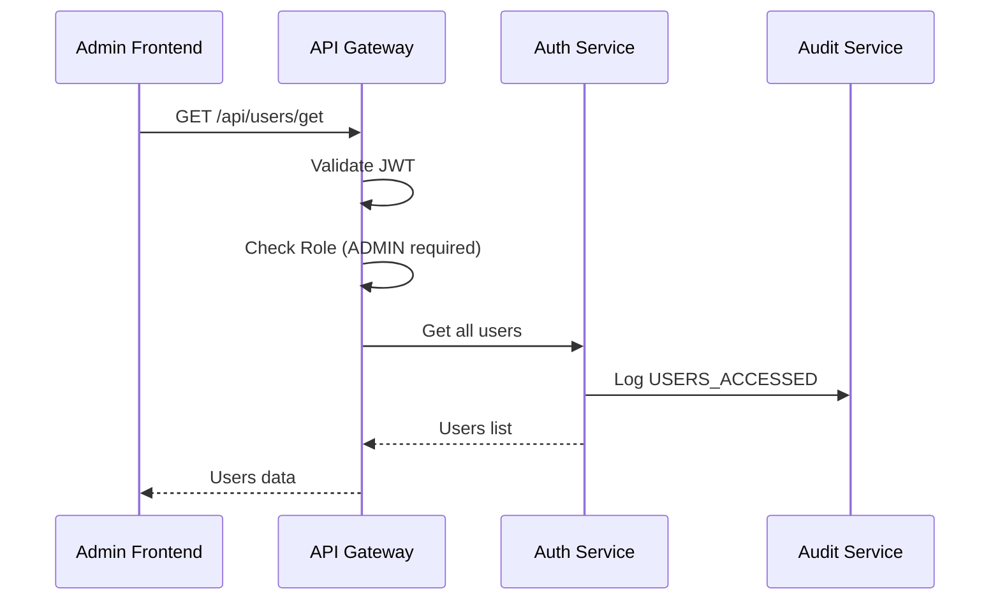

---

## 🔒 Security Filter Implementation

### **Gateway Filter Chain**
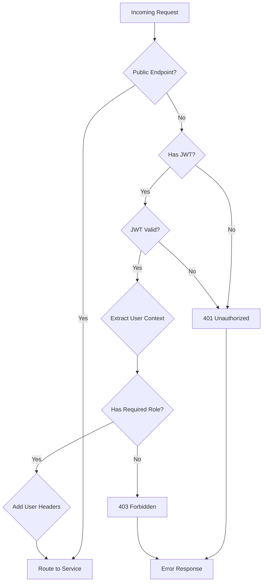

### **User Context Headers**
```http
# Headers added by Gateway after successful authentication
X-User-Id: 12345
X-Username: john.doe
X-Roles: CUSTOMER_USER,USER
X-Permissions: PERMISSION_READ,PERMISSION_WRITE
X-Customer-Id: 67890
X-Request-Id: req-123456
X-Timestamp: 2024-01-26T12:00:00Z
```

---

## 📊 Role-Based Access Matrix

| Endpoint | CUSTOMER_USER | BANK_STAFF | ADMIN | AUDITOR |
|----------|---------------|------------|-------|---------|
| `/api/auth/**` | ✅ | ✅ | ✅ | ✅ |
| `/api/customer/**` | ✅ | ✅ | ✅ | ❌ |
| `/api/account/**` | ✅ | ✅ | ✅ | ❌ |
| `/api/transaction/**` | ✅ | ✅ | ✅ | ❌ |
| `/api/audit/**` | ❌ | ❌ | ✅ | ✅ |
| `/api/users/**` | ❌ | ❌ | ✅ | ❌ |

---

## 🚨 Error Flow Examples

### **Authentication Error**
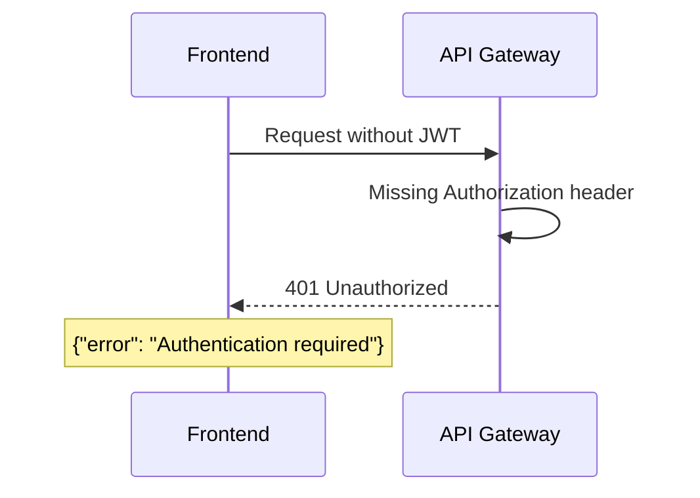

### **Authorization Error**
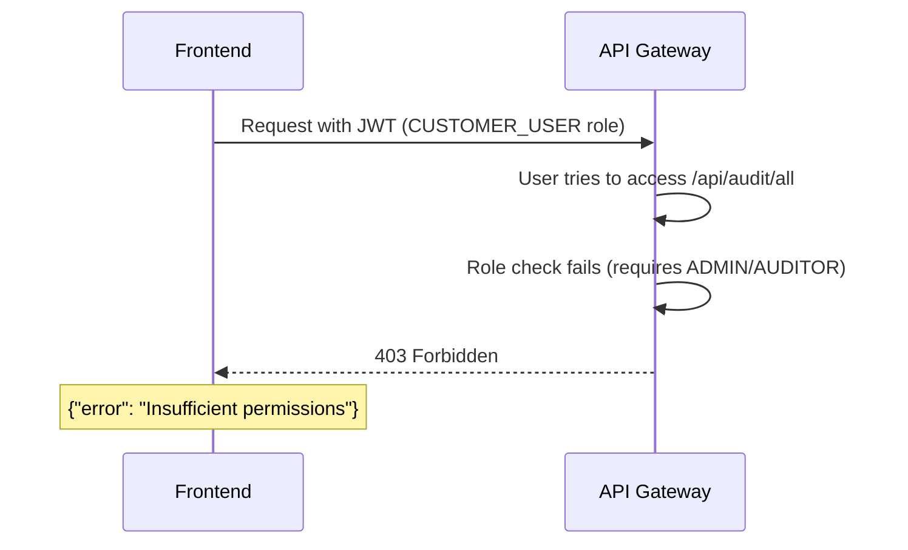

### **Token Expired Error**
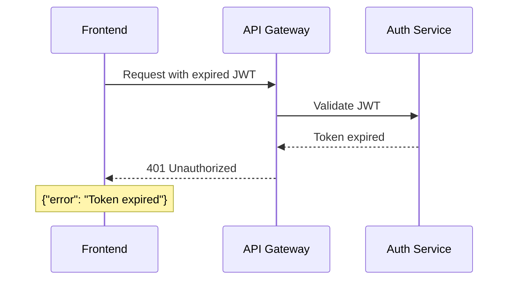

---

## 🎯 Security Features Summary

### **Authentication Features**
✅ **JWT Validation**: Token signature and expiry  
✅ **Token Refresh**: Automatic token renewal  
✅ **Multi-factor Support**: Ready for 2FA integration  
✅ **Session Management**: Secure session handling  

### **Authorization Features**
✅ **Role-Based Access**: Banking-grade RBAC  
✅ **Resource Ownership**: Users access own data only  
✅ **Permission-Based**: Fine-grained permissions  
✅ **Dynamic Authorization**: Runtime permission checks  

### **Security Headers**
✅ **OWASP Compliance**: Security headers applied  
✅ **CORS Configuration**: Cross-origin security  
✅ **Rate Limiting**: DDoS protection  
✅ **Audit Logging**: Complete audit trail  

### **Monitoring & Logging**
✅ **Request Tracing**: End-to-end request tracking  
✅ **Security Events**: Real-time security monitoring  
✅ **Performance Metrics**: API performance tracking  
✅ **Error Tracking**: Comprehensive error logging  

---

## 🏆 Implementation Status

**✅ Authentication**: **COMPLETE**  
**✅ Authorization**: **COMPLETE**  
**✅ Role-Based Access**: **COMPLETE**  
**✅ Security Headers**: **COMPLETE**  
**✅ Audit Logging**: **COMPLETE**  
**✅ Error Handling**: **COMPLETE**  
**✅ Monitoring**: **COMPLETE**  

**🎉 RESULT**: **PRODUCTION-READY BANKING-GRADE SECURITY**
